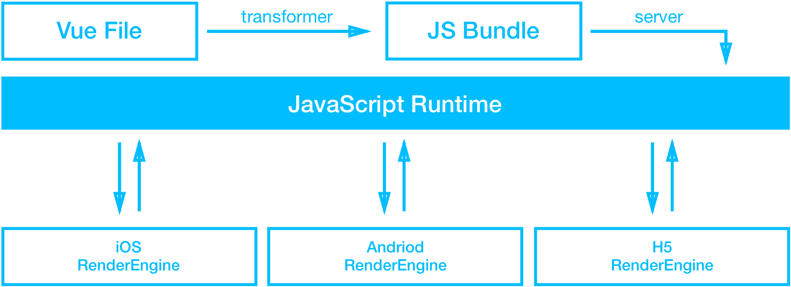

# Weex工作原理

## 一、Weex是什么

### 1.1、Weex构建的编程体验


关键: 业务逻辑使用JavaScript编写，界面在移动端上渲染出来的都是原生组件 ```<div>``` 和 ```<text>```


### 1.2、Weex实际执行过程

**概要过程**




## 二、Weex总体结构


## 三、 常见概念简介

- Weex源文件: .we 或 .vue文件
- JS Bundle: 由weex源文件经过transformer([webpack](https://webpack.github.io/))转化生成的.js文件
- Weex SDK: JS Framework + (JS Engine) + Native Render Engine
	* Native Render Engine: 基于iOS/Android原生代码(ObjectiveC/Java)编写的绘制引擎
	* JS Framework: 基于Vue 2.0开发的，native-bundle-main.js 简称 main.js就是JS Framework
- JS Engine: 解析运行JavaScript代码的引擎，iOS是JavaScriptCore.framework (JSContext)