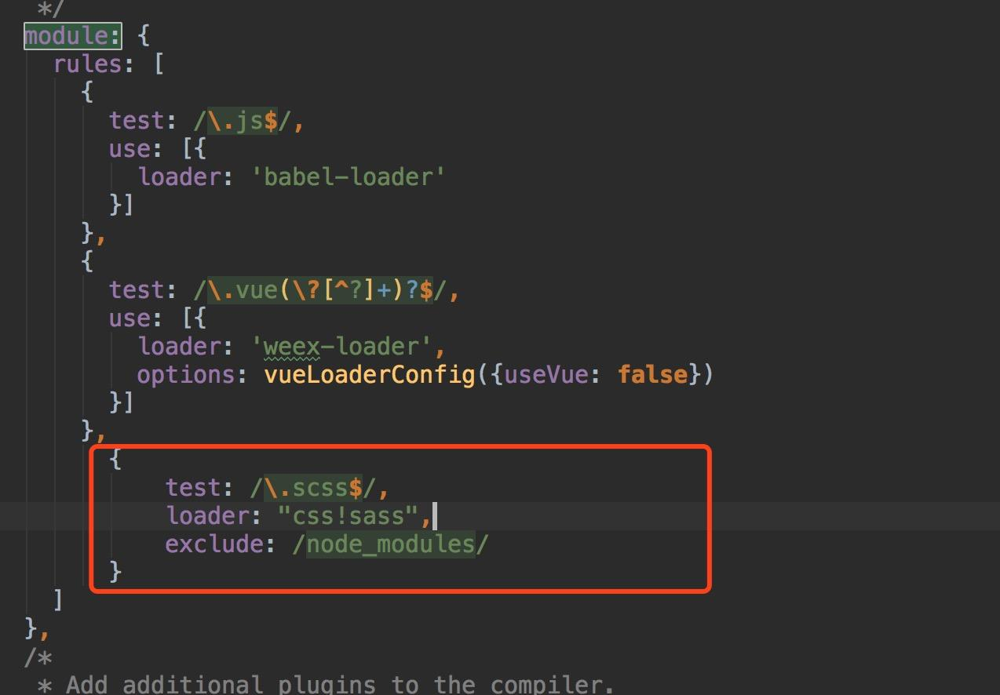

# 安装开发环境
Weex 官方提供了 weex-toolkit 的脚手架工具来辅助开发和调试。

首先，你需要 Node.js 和 Weex CLi。

## 1. 安装 Node.js

  方式多种多样，最简单的方式是在 [Node.js官网](https://nodejs.org/) 下载可执行程序直接安装即可。推荐使用[10.14LTS](https://nodejs.org/dist/v10.14.1/node-v10.14.1-x64.msi)。

  更多安装方式可参考 [Node.js官方信息](https://nodejs.org/en/download/)

  安装完成后，可以使用以下命令检测是否安装成功：
  
  

  通常，安装了 Node.js 环境，npm 包管理工具也随之安装了。因此，直接使用 npm 来安装 weex-toolkit。
  ```
  $ npm install -g weex-toolkit
  $ weex -v //查看当前weex版本
  ```

  查看weex-cli是否安装成功：

  

## 2. 安装相关依赖
- ES6:
	
	Weex中默认就有对其支持，但是对于async、await等，还需要如下一些简单配置：
	
	```
	//命令行安装
	npm install --save-dev babel-plugin-transform-runtime -g
	
	//然后在.babelrc文件中加入
	{
		"presets": [
			"es2015",
			"stage-0"
		],
		"plugins": [ [
			"transform-runtime",
			{
				"helpers": false,
				"polyfill": false,
				"regenerator": true,
				"moduleName": "babel-runtime"
			}
		]]
	}
	```

- [Vuex](https://vuex.vuejs.org/zh/)

	类似Redux，如果你没听说Redux不要紧，也不要怂，简单了说，Vuex就是单页面下，帮你管理数据的框架。数据都存在Vuex的store中，你操作store更新数据，然后将store绑定到界面。它的用处在于可以在多个vue组件间，方便的同步数据，更新界面。
	
- [Vue-Router](https://router.vuejs.org/zh/) 
	
	用于单页面下，指定跳到某个页面的管理工具
	
- [webpack](https://www.webpackjs.com/)

	本质上，webpack 是一个现代 JavaScript 应用程序的静态模块打包器(module bundler)。

- [iconfont](http://www.iconfont.cn/)

	矢量图标，少不了iconfont，通过字库生成图标，资源丰富，绝对值得推荐。
	
- [weex-ui](https://github.com/alibaba/weex-ui)

	一个基于 Weex 的富交互、轻量级、高性能的 UI 组件库
	
- [sass/scss](https://www.sasscss.com/docs/)

	当weex项目不断变大，一些样式共享，公共颜色，大小尺寸等的管理，就是你需要面对的问题。这时候sass和scss就可以起到很大的作用。最大优点是，它可编程，支持定义变量，而且不像阉割后的css一样，var()这种写法无法在native下得到支持，这时候sass的效果绝对让你回味无穷。
	使用sass也十分简单，简单配置下webpack，sass的语法也十分容易上手，具体步骤如下：
	
	- 安装sass依赖：
	
	```
	npm install node-sass;
	npm install sass-loader; //依赖node-sass
	```
	- 之后webpack.common.conf.js中配置loader，如下图，在两个module处，增加红框配置。
	
	
	- 最后用 import 引入的sass文件进行加载，详细可查看demo工程。
	
	```
	//也可以 lang="scss"
	<style lang="sass">
		//导入写好的文件
		@import "./style.scss";
	</style>
	```


## 3. 多页配置
Weex默认是单页面效果，也就是Android中一个Activity的概念，而单页面效果在原生上，所以这个时候，就需要修改默认的webpack，让其支持naive多页面。

首先，要知道Weex真正运行的是，通过<font color=red>entry.js</font>作为入口文件文件，通过webpack，将<font color=red>.vue</font>文件打包成<font color=red>index.js</font>进行使用。Look，多页面的重点，就是将独立页面的<font color=red>.vue</font>文件，生成多个js文件。


如上图，参考<font color=red>entry.js</font>文件，创建一个SecondPageEntry.js，作为SecondPage.vue的入口，用于webpack生成SecondPage.js页面。
 什么？webpack没听说过怎么办，No problem，你只需简单的修改，一知半解完全可以胜任。如下图，我们主要需要修改<font color=red>webpack.common.conf.js</font>文件，
 
 

可以看出，<font color=red>webpack.common.conf.js</font>中，其实是区分了<font color=red>webConfig</font>和<font color=red>weexConfig</font>的不同打包方式。如下图，其中<font color=red>weexEntry</font>就是我们需要修改的地方，可以看到本来已经有index和entry.js存在了。


最后我们需要通过navigator来实现跳转，我们需要知道，要跳转的js文件在哪里，如下代码演示，如何实现navigotor的native跳转，完整兼容三端跳转请移步demo项目。

```
 //获取当前js文件所在完整路径
 let bundleUrl = this.$getConfig().bundleUrl;
 bundleUrl = String(bundleUrl);
 let nativeBase;
 //android一般位于file://assets目录下
 let isAndroidAssets = bundleUrl.indexOf('file://assets/') >= 0;
 //ios一般位于一般带有file开头，带有WeexDemo.app
 let isiOSAssets = bundleUrl.indexOf('file:///') >= 0 && bundleUrl.indexOf('WeexDemo.app') > 0;
 if (isAndroidAssets) {
     nativeBase = 'file://assets/dist/';
 } else if (isiOSAssets) {
     nativeBase = bundleUrl.substring(0, bundleUrl.lastIndexOf('/') + 1);
 } else {
    let host = 'localhost:8080';
    let matches = /\/\/([^\/]+?)\//.exec(bundleUrl);
    if (matches && matches.length >= 2) {
        host = matches[1];
    }
    nativeBase = 'http://' + host + '/index.html?page=./dist/';
 }
 return nativeBase;
```

 	
 		


