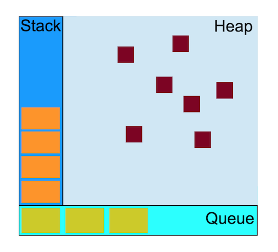
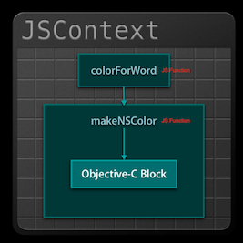
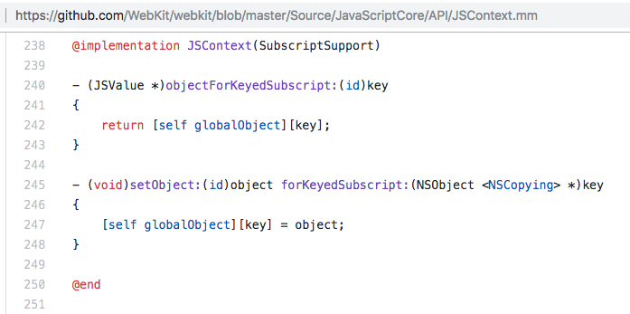
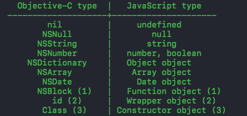
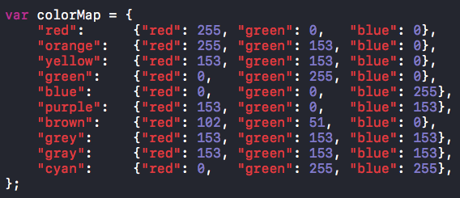
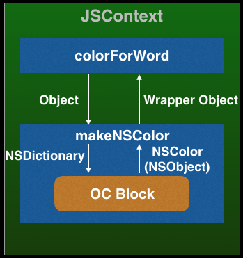
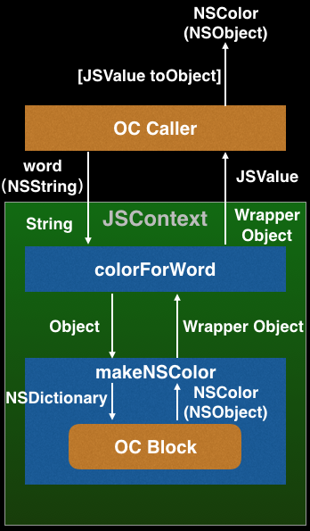
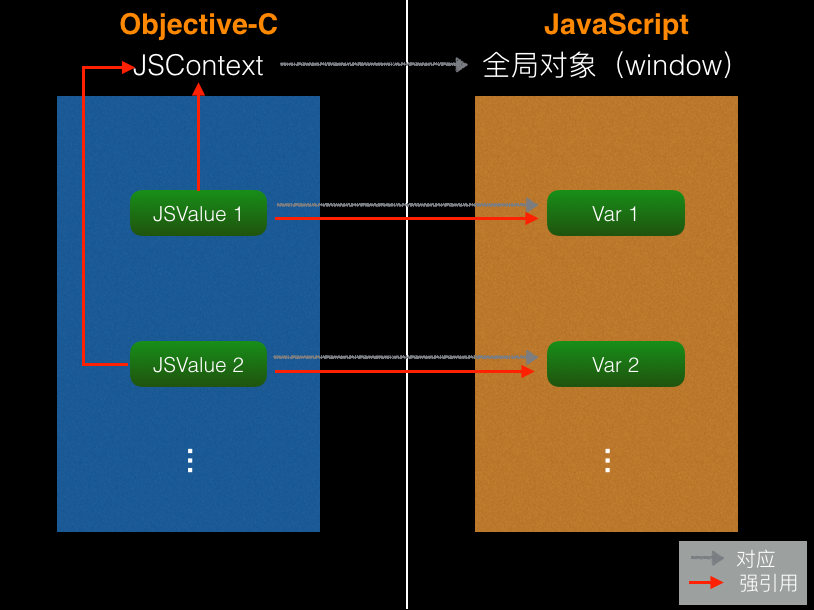

# JS及Native(iOS)基础知识

## 一、知识准备 - JavaScript和Native

### 1.1 JavaScript Runtime

***[JavaScript内存可视化描述](https://developer.mozilla.org/zh-CN/docs/Web/JavaScript/EventLoop)(Stack + Heap + Queue)***



***JavaScript Event Loop***

```
while (queue.waitForMessage()) {
  queue.processNextMessage();
}
```

### 2.2 Native Runtime

***Native C Runtime内存(Stack + Heap)***


***iOS Event Loop(Queue)***


## 二、知识准备 - Native <-> JavaScript Bridge

***JS -> OC***

```
// JavaScript function: colorForWord

var colorForWord = function(word) {
    if (!colorMap[word])
        return;
    return makeNSColor(colorMap[word]);
};
```



```
// ObjectiveC Inject OC Block as JS Function "makeNSColor"

#import <JavaScriptCore/JavaScriptCore.h>

JSContext[@"makeNSColor"] = ^(NSDictionary *color){
    float r = [color[@"red"] floatValue];
    float g = [color[@"green"] floatValue];
    float b = [color[@"blue"] floatValue];
    return [NSColor colorWithRed:(r / 255.0)
                           green:(g / 255.0f)
                            blue:(b / 255.0f)
                           alpha:1.0];
};
```

JSContext[@"makeNSColor"]语法 [JSContext.mm](https://github.com/WebKit/webkit/blob/master/Source/JavaScriptCore/API/JSContext.mm):

```
JSContext[@"makeNSColor"] = ^(NSDictionary *color){};
//等价于
[JSContext globalObject][@"makeNSColor"] = ^(NSDictionary *color){};
```



OC和JS类型对照[Converting Between JavaScript and Native Types](https://developer.apple.com/documentation/javascriptcore/jsvalue):



详细执行过程:





***OC -> JS***

```
#import <JavaScriptCore/JavaScriptCore.h>

NSArray *args = @[@"red"];
[[JSContext globalObject] invokeMethod:@"colorForWord" withArguments:args];
```

详细执行过程:



***OC <-> JS 内存***



参考文档：[深入浅出 JavaScriptCore](http://www.cocoachina.com/ios/20170720/19958.html)


